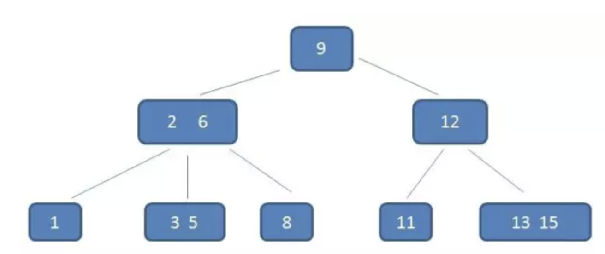
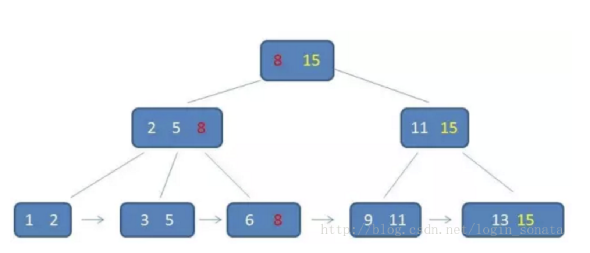

### B(B-)树(MongoDB)
B树是一个m叉的多路平衡搜索树(矮胖)，具有除搜索树特点外以下特点: 
+ M阶定义为任意非叶子结点最多有M个孩子结点(M>=2)
+ 根结点的孩子数为[2,M]，关键字为[1,M]
+ 除根结点以外的非叶子结点的孩子树为[M/2,M]，向上取整，那么关键字的个数为其减去1
+ 非叶子结点的关键字个数=孩子结点数-1
+ 所有叶子结点层次相同
+ k个关键字将结点拆分成k+1段，分别指向k+1个孩子，并满足查找树的大小关系

#### 插入
1. 根据要插入的data，找到叶子结点并插入
2. 判断当前结点关键字的个数是否小于等于M-1(最多M孩子结点)，满足结束，不满足进行3
3. 以结点中心的关键字分裂成左右两部分，将中间结点插入父结点，这个关键字左子结点右子结点分别指向分裂后的左右两部分，
将当前操作结点变更到父结点，重复2～3  

#### 删除
1. 删除key在非叶子结点，用后继记录覆盖要删除的key，在后继记录所在子支删除该记录(后继记录一定位于叶子结点上)(变更操作结点)
2. 该结点关键字个数是否大于等于M/2-1(向上取整，最少M/2孩子结点)，满足结束，不满足进行3
3. 该结点兄弟结点(左右任意)关键字个数大于M/2-1，父节点的key下移到当前结点，兄弟结点一个key上移，删除操作结束，否则将父节点的key下移与
当前结点和兄弟结点合并成一个新的孩子结点，重复2~3

[B树插入操作,作者写作B+树有误](https://www.cnblogs.com/nullzx/p/8729425.html)
[B树插入操作](http://data.biancheng.net/view/60.html)

### B+数(Mysql)
B+树是一个m叉的多路平衡搜索树，是B树的一种变体: 
+ 非叶子结点关键字个数=孩子结点数
+ 同一元素会出现在不同的结点，根结点最大元素为树的最大元素
+ 所有的叶子结点包含了全部关键字的信息以及指向关键字的指针，叶子结点自小到大顺序连接
+ 所有的非叶子结点保存指向子结点的指针，不保存数据
+ 通常B+树有两个头指针，分别指向根结点和关键字最小的叶子结点

#### B+树查询优势(mysql)
+ B+树中间结点不保存数据数据，可以保存更多的结点元素
+ B+树的查询效率更加稳定，不会查询到非叶子结点就停止
+ B+树可以范围查询，无序遍历整棵树，只需要遍历叶子结点链表

### 插入删除
在 B树中的每个结点关键字个数 n 的取值范围为⌈m/2⌉ -1≤n≤m-1，而在 B+树中每个结点中关键字个数 n 的取值范围为：⌈m/2⌉≤n≤m  
对应了B+树非叶子结点关键字个数=孩子结点数  
所有的非叶子结点可以看成是索引部分，结点中仅含有其子树（根结点）中的最大（或最小）关键字  
注意:  
+ 插入的操作全部都在叶子结点上进行，且不能破坏关键字自小而大的顺序
+ 由于 B+树中各结点中存储的关键字的个数有明确的范围，做插入操作可能会出现结点中关键字个数超过阶数的情况，此时需要将该结点进行“分裂”
+ 如果插入的关键字比当前结点中的最大值还大，破坏了B+树中从根结点到当前结点的所有索引值，此时需要及时修正后，再做其他操作
[B+树插入操作](http://data.biancheng.net/view/61.html)
