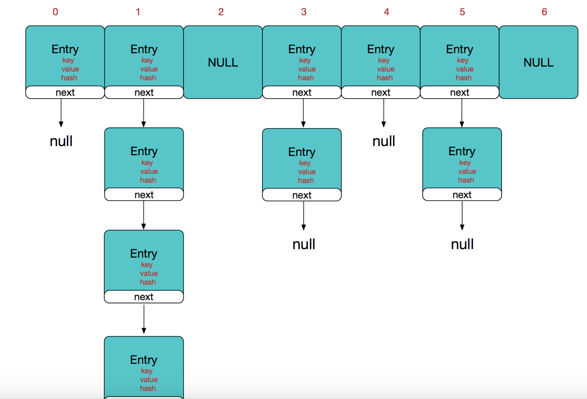
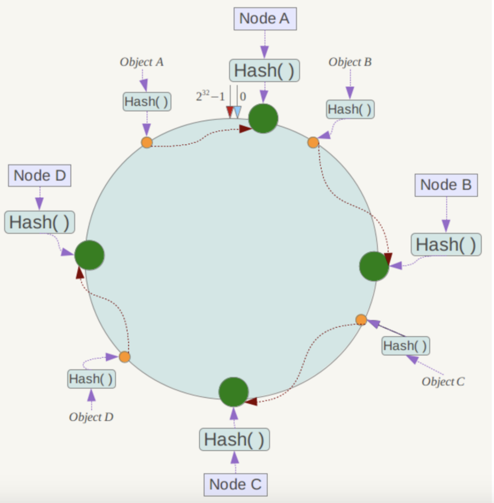
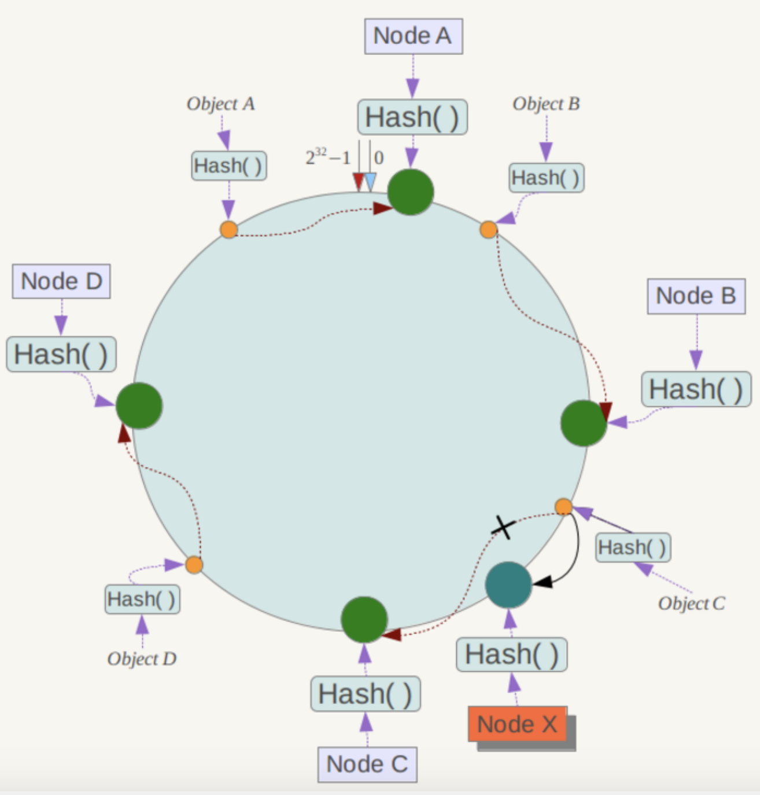

### hash
将任意长度的输入通过散列算法堪称固定长度

#### hash冲突
在hash过程中，有可能会得到不同的输入有相同的hashCode，导致了hash冲突  
解决hash冲突方法:  
1.再散列(开放定址法)  
当value=hash(key)产生冲突时，对value进行再次散列，直到找到一个不冲突地址  
例如一个通用再散列模式，Hi=（H（key）+di）% m   i=1，2，…，n，通过不同的di分为下三种    
+ 线性探测再散列法
di成线性1，2，3
+ 二次探测再散列
di成跳跃1^2，-1^2，2^2，-2^2，…，k^2，-k^2(k<=m/2)
+ 伪随机探测再散列
di为随机数

2.再hash  
通过不同的hash函数找到一个不冲突的hash地址

3.链地址法  
将所有hash值为p的key连接到同一个链表中，查找插入删除在链表中完成(hashmap使用此方法)

#### hashmap
hashmap由数组+链表组成，链表用来解决hash冲突(链表长度超过8会转换成红黑树)，链表出现的越少，性能越高  
hashmap查找插入删除的时间复杂度为O(1)(仅需一次定位)  

hashmap初始化中默认容量为16(最好是2幂次方)，复杂因子为0.75(统计学泊松分布)，在第一次put操作的时候才会去构建hashmap  
负载因子的存在是为了减缓hash冲突，当hashmap容量达到容量*负载因子时，hashmap会扩容至两倍  
+ 负载因子过高可以减少空间开销，但是hash冲突的概率会高，降低了查询效率
+ 负载因子过低可以增加查询效率，但是会增加空间开销
+ 容量扩容两倍的原因(TODO) [hashmap容量2幂次方](https://blog.csdn.net/woshimaxiao1/article/details/83661464)

#### 一致性hash算法
在分布式系统中，集群中随时可能有节点加入或者删除，需要用合适的算法保持一致性，要不然会造成系统中的数据丢失(即由于系统节点数目变少，
客户端在请求某一对象时需要重新计算其hash值（通常与系统中的节点数目有关），由于hash值已经改变，所以很可能找不到保存该对象的服务器节点)  
一致性hash算法满足Monotonicity(单调性) Balance(平衡性) Spread(分散性) Load(负载) Smoothness(平滑性)
+ 平衡性
+ 单调性
+ 分散性
+ 负载
+ 平滑性

一致性hash算法将整个hashCode空间组成一个封闭的虚拟圆环，假设整个值空间为0-2^32-1，0和2^32-1重合，整个空间按照顺时针方向组织，将各个服
务器(ip等)作为一个入参进行hash以确定在整个hash空间的位置，此时将数据用同样的hash确定位置，顺时针找到第一个服务即访问的服务器  

比如新增NodeX或者NodeC发生宕机，C对象会被重新定位到NodeX或者NodeC，受影响的范围为当前服务器到前一个服务器之间的数据

当节点数量较少时，大量数据会被倾斜到某一个服务器上，为了解决数据倾斜的问题，一致性hash引入虚拟节点，通过key-1,key-2来实现，但会多一步
虚拟节点到真实节点的映射

#### hash槽
redis cluster采用数据分片的哈希槽来进行数据存储和数据的读取  
redis cluster一共有2^14（16384）个槽，所有的master节点都会有一个槽区比如0～1000，槽数是可以迁移的  
master节点的slave节点不分配槽，只拥有读权限。但是注意在代码中redis cluster执行读写操作的都是master节点，并不是读是从节点，写是主节点

##### 一致性hash与hash槽对比
+ hash槽不是闭合的，key的定位规则是根据CRC-16(key)%16384的值来判断属于哪个槽区，从而判断该key属于哪个节点，
而一致性哈希是根据hash(key)的值来顺时针找第一个hash(ip)的节点，从而确定key存储在哪个节点。
+ 一致性哈希是创建虚拟节点来实现节点宕机后的数据转移并保证数据的安全性和集群的可用性的，redis cluster是采用master节点有
多个slave节点机制来保证数据的完整性的,master节点写入数据，slave节点同步数据。当master节点挂机后，slave节点会通过选举机制选举出
一个节点变成master节点，实现高可用