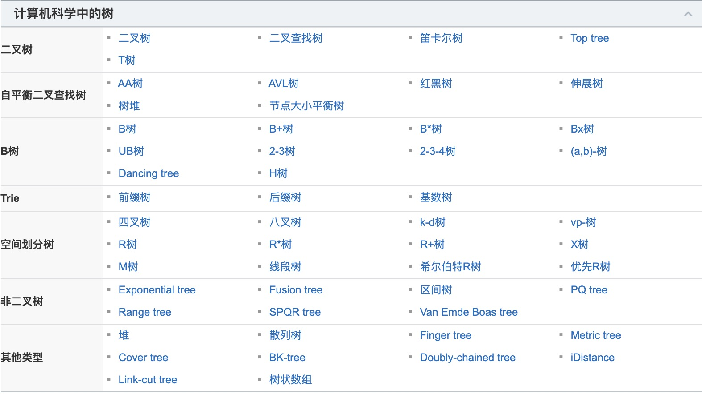
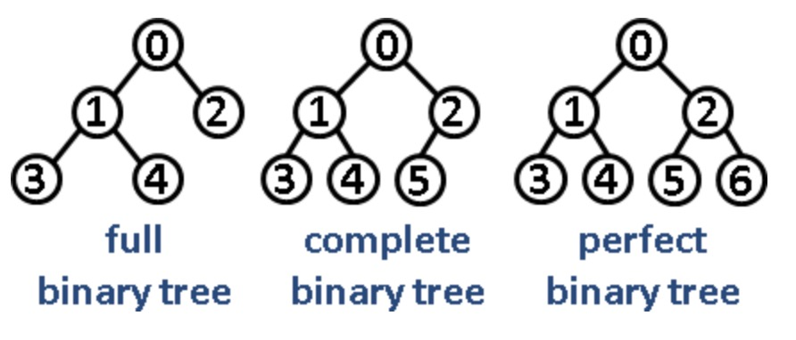

### 树(包含n个节点的有穷集)
1. 有节点间的层次关系，分为父节点和子节点
2. 有唯一一个根节点，该节点没有父节点
3. 除了跟节点外，每个节点有唯一的父节点
4. 每个节点及它的后代也是一颗树
5. 没有后代节点的为叶子节点，没有节点的为空树

#### 树的相关概念
+ 节点的度: 该节点的子节点个数
+ 树的度: 最大节点的度
+ 节点层次: 根节点为0，往下类推，空树为0
+ 树的高度(深度): 节点的最大层次

#### 树的类型  
  

#### 二叉树的时间复杂度
+ 二叉树: 每个节点最多含有两个子树的树  
+ 二叉搜索树(BST): 它或者是一棵空树，或者是具有下列性质的二叉树，
若它的左子树不空，则左子树上所有结点的值均小于它的根结点的值；若它的右子树不空，则右子树上所有结点的值均大于它的根结点的值(不存在键值相等的结点)  
+ 平衡二叉树: 二叉搜索树上树的左右层级相差不超过1
对于一颗二叉搜索树，查找插入删除操作的时间复杂度都是O(logn)  

[二叉搜索树连接](https://baike.baidu.com/item/%E4%BA%8C%E5%8F%89%E6%8E%92%E5%BA%8F%E6%A0%91/10905079?fromtitle=%E4%BA%8C%E5%8F%89%E6%9F%A5%E6%89%BE%E6%A0%91&fromid=7077965)

#### 二叉树的类型
|类型| 描述  | 注释 |
|:----|:----  |:----|
|完满二叉树|除叶子节点外每一个节点都有两个孩子|所有非叶子结点的度为2|
|完全二叉树|除最后一层外每一层都被填满，所有节点保持向左对齐|除叶子结点外满足完美二叉树|
|满(完美)二叉树| 除叶子节点之外每一个节点都有两个孩子，所有的叶子节点处于同一层|k高度的树且有2^(k+1)-1个结点|

#### 二叉树的遍历
前序遍历(根左右) 中序遍历(左根中) 后序遍历(左右中)

#### 二叉树的删除
1. 删除结点为叶子结点，直接删除
2. 删除结点仅有左孩子结点或右孩子结点，用其覆盖删除结点
3. 删除结点有左右孩子结点，需要寻找后继结点(比关键字大的集合的最小值)(右子树的左后代)

###### 等比数列求和
s = a1(1-q^n)/(1-q) a1为首项，n为第n，q为比例
