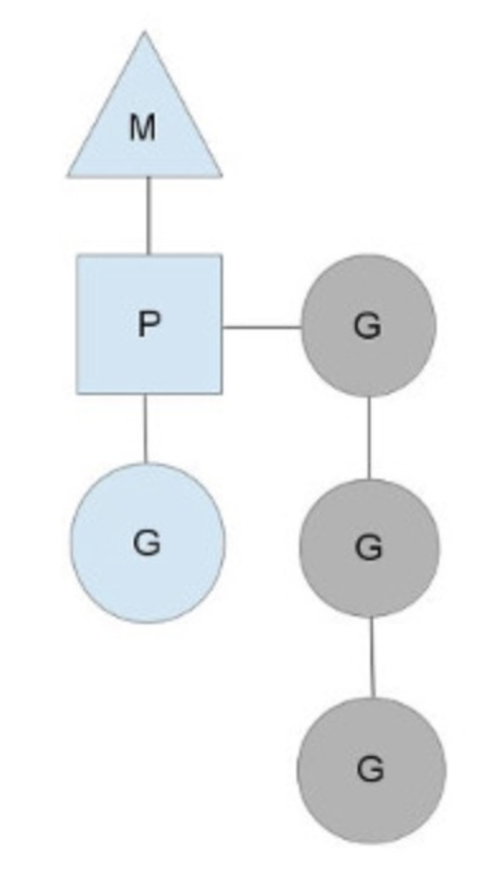
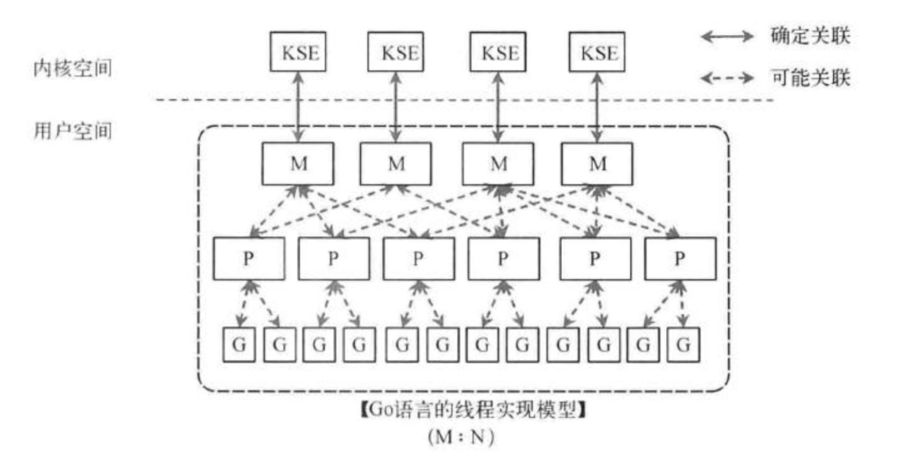
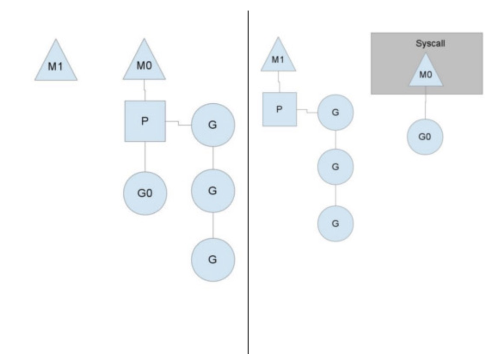

#### 进程与线程
+ 进程是最小的资源分配单位，线程是最小的执行单位
+ 进程拥有自己的内存地址，线程共用进程的地址空间，共享进程的数据
+ 线程之间通信方便，进程之间通信需要通过IPC
+ 多线程中一个线程死掉，整个进程死掉，而多进程中一个进程死掉不会影响整个多进程

#### 进程切换
1. 保存处理机上下文，包括程序计数器和其他寄存器
2. 更新PCB信息
3. 把进程的PCB移入相应的队列，如就绪、在某事件阻塞等队列
4. 选择另一个进程执行，并更新其PCB
5. 更新内存管理的数据结构
6. 恢复处理机上下文

### 进程线程通信
[通信方式](https://www.cnblogs.com/fanguangdexiaoyuer/p/10834737.html)

##### IPC进程通信方式
+ 管道：单向传递(无名管道,速度慢，容量有限，仅限于父子进程)(FIFO:命名管道,速度慢)
+ 消息队列：容量收到系统限制，读取消息时需要考虑到上一次未读完的数据
+ 信号量：用于同步，不能传递复杂消息
+ 共享内存：能够很容易控制容量，速度快，但要保持同步，比如一个进程在写的时候，另一个进程要注意读写的问题，相当于线程中的线程安全
+ 套接字socket

##### 线程通信方式
+ 消息传递（管道、FIFO、消息队列）
+ 共享内存（锁、全局变量）

### 协程优势
1.调用与切换相对于线程效率更高  
线程的调用与切换由操作系统内核完成，线程在等待IO操作时会变成unrunnable状态，触发上下文切换，由于抢占调度机制，上下文切换一般发生在
时钟中断和系统调用返回前，调度器计算当前线程的时间片，并从运行运行队列中取出一个目标线程，保存当前，切换到目标  
golang协程切换不依赖于系统，由GMP调度策略完成，协程之间的切换发生在用户态，在用户态没有时钟中断，系统调用等机制,因此效率高  
2.占用内存空间更小，线程1M，协程约5KB  
 
### GMP调度策略  

M:machine，一个M关联了一个内核线程  
P:process，M的上下文  
G:goroutine，协程  
一个M连接一个P，一个P连接多个G，P由环境变量默认或者手动设置  

### 是否能去除P  
不能，当遇到内核阻塞的时候，需要通过上下文切换线程  
eg:    

当M0的G0需要调用syscall的时候，M0会丢弃P，并等待G0的系统返回，此时新创建或者已存在的M1会接受P继续执行P的队列中后面的G，
当G0的系统调用结束后，M0会偷一个P，如果没有，M0会将G0丢到全局runqueue中，自己进入线程池并休眠。  
全局的runqueue是用以给P在运行完自身的G后拉取新的G的地方，当runqueue为空的时候，P会从其他的P中偷取一半G。同时，P也会周期性的检查runqueue
以避免runqueue的G被饿死。