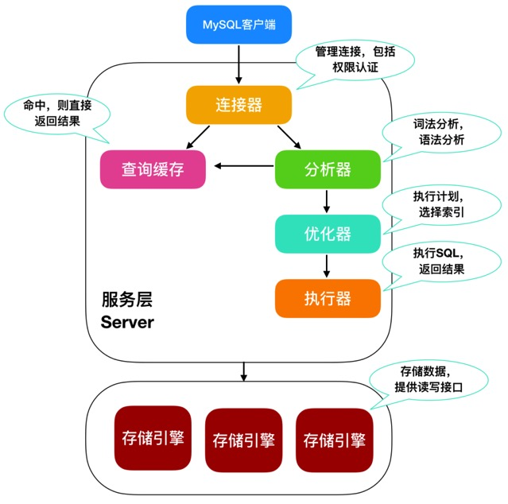
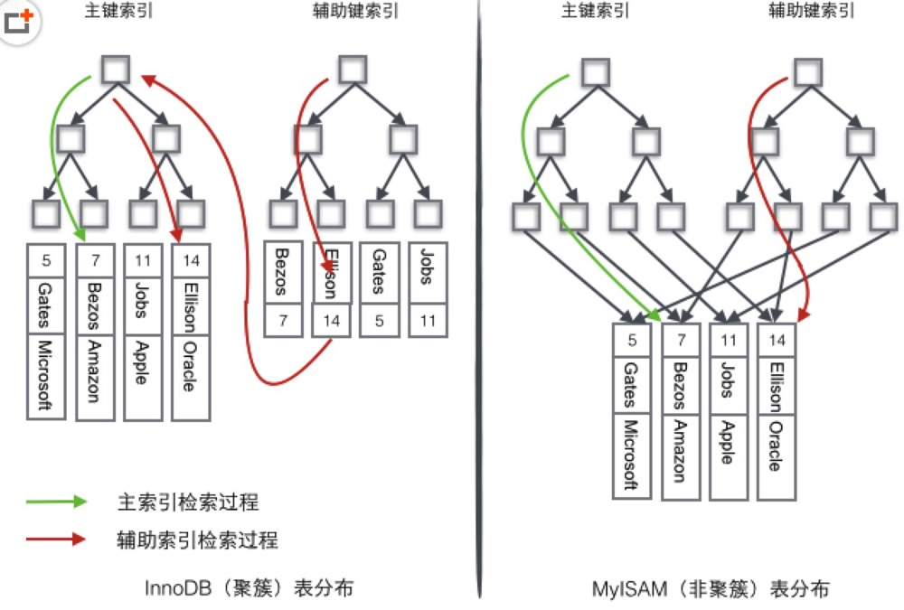
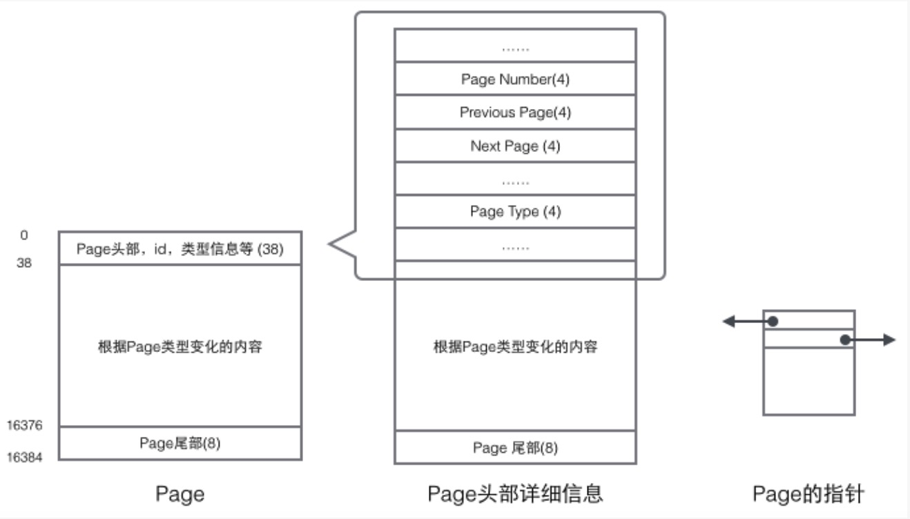
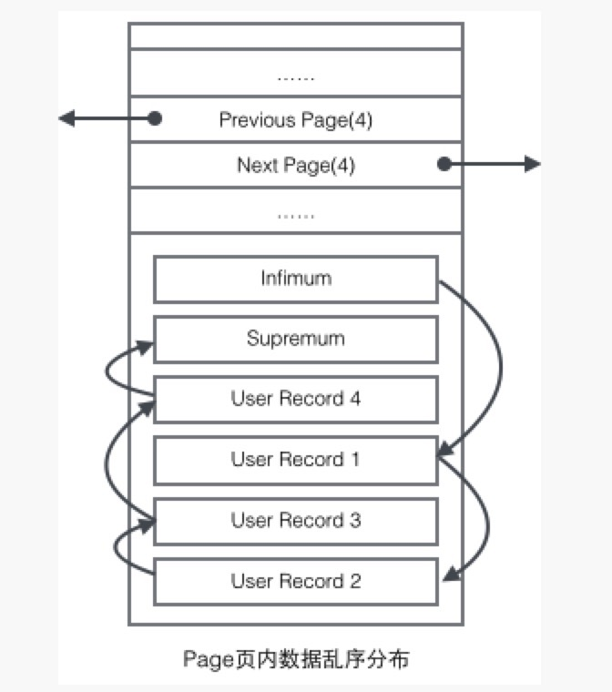
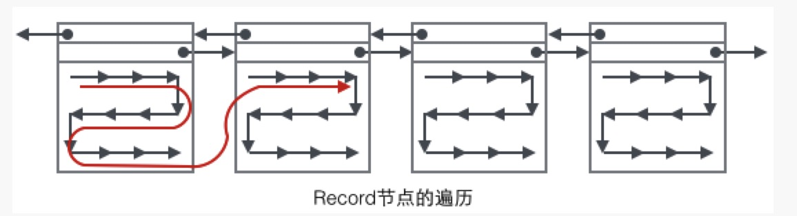
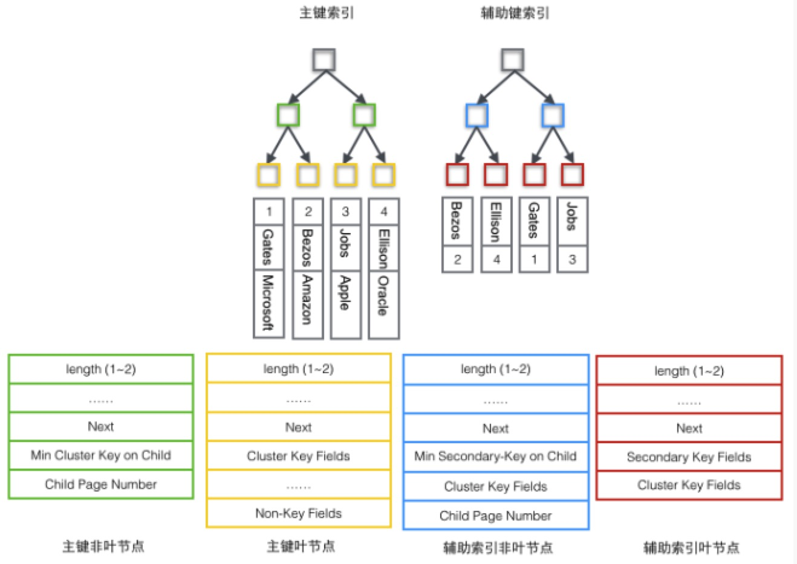
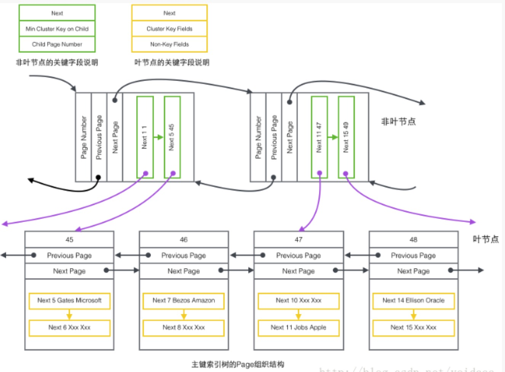
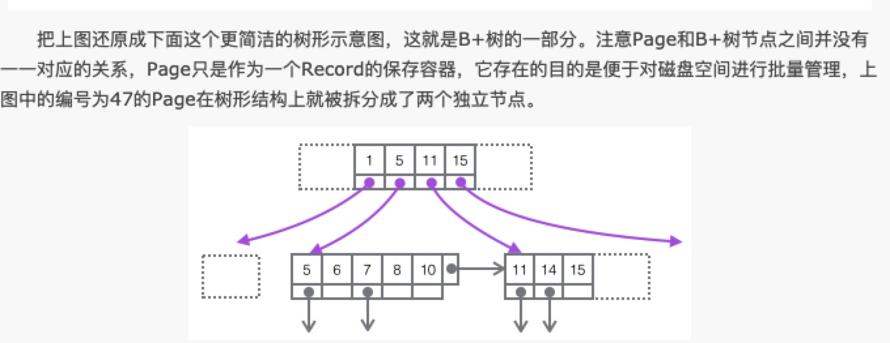

### 三大范式和五大约束
第一范式: 数据表中的每一列（每个字段）必须是不可拆分的最小单元，也就是确保每一列的原子性  
第二范式: 满足1NF后，要求表中的所有列，都必须依赖于主键，而不能有任何一列与主键没有关系  
第三范式: 必须先满足2NF，表中的每一列只与主键直接相关而不是间接相关  

五大约束: 
+ primary key: 设置主键约束
+ unique: 唯一性约束
+ default: 默认值约束
+ not null: 非空约束
+ foreign key: 外键约束

### mysql关键字执行顺序
from join on where group by having select distinct order by limit  
查表构建虚拟表 过滤条件 分组 having 选择对应字段 去重 排序 个数

### sql执行过程
一条sql语句通过连接器去查询缓存器，缓存器中存储的为key(sql)-value(结果)，命中缓存会直接返回结果(通常不使用，表数据更新一次缓存即失效)，
sql会通过分析器，对sql进行语法检查，判断sql是否正确，表和字段是否存在，之后进入优化器，对sql进行优化，使得查询效率最高，最后通过执行期器
去储存引擎执行sql并得到结果  



### sql优化
+ 查询语句尽量走索引，不要使用 !=、<、> 等操作符号，会全表扫描
+ 使用explain + sql(select) 查看分析结果
+ 不直接使用select *，应具体到具体字段
+ 创建索引(字符字段使用前缀索引)
+ 选择合适的字段类型长度
+ 避免使用null，不要在索引上做运算(id-1 = 9)，会导致索引失效
+ 进行水平切割和垂直切割(水平切割即相同结构分表，垂直切割即区分热点字段数据和非热点字段，不同结构分表，同一主键id)

### sql注入及防范
sql注入是指在api对用户输入数据的合法性未做校验或者校验不足的情况下，在程序实现设定好的sql语句后面添加额外的语句从而获得信息  
防护: 
+ 加强对用户输入的校验，限定输入长度即类型
+ 使用转义，限制关键字的输入
+ 使用预处理  
[sql注入原理及防范](https://www.cnblogs.com/simon7s/p/12420632.html)

### 事物特性及隔离级别
ACID原则  
Atomicity(原子性) Consistency(一致性) Isolation(隔离性) Durability(持久性)  
原子性 事物执行操作是不可分割的，操作全部发生或者全部不发生  
一致性 事物开始前和结束后，数据库的完整性约束没有被破坏  
隔离性 事物之间是相互隔离的  
持久性 事物执行完成后，就会持久化的保存在数据库中

read uncommitted 读未提交，造成脏读  
read committed  读提交，不可重复读，解决脏读 oracle默认  
repeatable read  可重复读，解决脏读和不可重复读，mysql默认(可以通过MVCC解读幻读)  
serializable 串行化，可以解决 脏读 不可重复读 和 幻读—相当于锁表  

eg:  
1.脏读:事务A读取了事务B更新的数据，然后B回滚操作，那么A读取到的数据是脏数据  
2.不可重复读:事务A多次读取同一数据，事务B在事务A多次读取的过程中，对数据作了更新并提交，导致事务A多次读取同一数据时，结果不一致  
3.幻读:系统管理员A将数据库中所有学生的成绩从具体分数改为ABCD等级，但是系统管理员B就在这个时候插入了一条具体分数的记录，
当系统管理员A改结束后发现还有一条记录没有改过来，就好像发生了幻觉一样，这就叫幻读  
不可重复读发生在多次读取，而幻读发生在更新

|事务隔离级别|脏读|不可重复度|幻读|
|:----|:----|:----|:----|
读未提交（read-uncommitted）|是 |	是|	是|
不可重复读（read-committed）|	否|	是 | 是|
可重复读（repeatable-read）|	否|否|是|
串行化（serializable）|	否|	否	|否|

#### MVCC版本控制
版本链：在innoDB中，它的聚簇索引记录中包含了两个隐藏列(可见于undo日志)  
+ trx_id: 每次对某条记录进行改动时，都会把对应的事务id赋值给trx_id隐藏列
+ roll_pointer: 每次对某条记录进行改动时，这个隐藏列会存一个指针，可以通过这个指针找到该记录修改前的信息

readView：(事务生成)
+ m_ids: 生成当前readView时活跃的读写事务列表
+ min_trx_id: 生成readView时最小的事务id
+ max_trx_id: 生成readView时系统分配给下一个事务的id
+ creator_trx_id: 生成该readView的事务id

由此，我们知道当一个事务访问某条记录时，会根据readView判断该记录的某个版本是否可见
+ 当被访问记录的trx_id与creator_trx_id相同时，表示该事务访问自己修改过的记录，当前可见
+ 当被访问记录的trx_id比min_trx_id小时，表示该记录的事务在readView生成时已经提交，可见
+ 当被访问记录的trx_id比max_trx_id小时，表示该记录的事务在readView生成之后才开启，不可见
+ 当被访问记录的trx_id在min_trx_id和max_trx_id之间时，判断是否存在m_ids中，不存在即可见，存在即不可见

生成readView时机: RC级别下在每次读取前都会生成，RR级别下事务第一次读取事务时生成

### 主键索引与聚集索引区别:  
1. 主键索引强制表的完胜行，聚集索引用于查询数据  
2. 一个表最多只能有一个主键索引和聚集索引，通常情况下为同一个  
3. 主键不允许null，聚集索引允许null  
4. 主键要求数据必须唯一，而聚集索引不要求  
5. 数据库在创建主键同时，会自动建立一个唯一索引。
   如果这个表之前没有聚集索引，同时建立主键时候没有强制指定使用非聚集索引，
   则建立主键时候，同时建立一个唯一的聚集索引；如果未使用 UNIQUE 属性创建聚集索引，数据库引擎 将向表自动添加一个四字节 uniqueifier 列。
   必要时，数据库引擎 将向行自动添加一个 uniqueifier 值，使每个键唯一。
   此列和列值供内部使用，用户不能查看或访问 
   
#### 主键索引和索引的区别:
主键要求数据必须唯一且不允许null，而索引不要求，唯一索引会要求，主键索引的叶子节点包含了完整的数据信息，而一般索引包含的信息则是其本身
和主键值，再通过主键值获得其他的数据信息  
eg:  
当我们在id和name上分别建立了主键索引和一般索引时  
下面查询语句可以直接查询出所有值
```
select id, name, phone from table where id = 1;
```
当通过一般索引name查询时可以查询出id与name值，但是phone的值会通过
id值再去查询一遍主键索引，时间花费较长
```
select id, name, phone form table where name = 'a';
```

#### 聚集索引与非聚集索引的区别:  

#### InnoDB和MyISAM引擎
###### 对比
+ 锁粒度，InnoDB支持到行锁，而MyISAM最多支持到表锁
+ 可恢复性，InnoDB有事物日志，而MyISAM没有
+ 查询性能，InnoDB查询过程中需要维护数据缓存，先定位到数据块再查询到对应的行，MyISAM直接定位到内存地址
+ 表结构文件，InnoDB表结构文件包括 .frm(表结构定义) .MYI(索引) .MYD(数据)，MyISAM为 .ibd和.frm

###### 表分布


注意到，聚簇索引的行数据和叶子节点储存在一起，通过主键Id查询数据，获得数据更快 
辅助索引使用主键作为叶子节点的值，而不是使用数据地址值作为叶子节点值，减少了当出现行移动或者数据页
分裂时辅助索引的维护工作，使用主键值当作指针会让辅助索引占用更多的空间，换来的好处是InnoDB在移动行时
无需更新辅助索引中的这个指针。行的位置会随着数据库中数据的修改而变化，使用聚簇索引可以保证这个主键B+树
的节点如何变化，辅助索引树都不会受到影响

MyISAM引擎存储叶子节点并不会保存行数据，保存的是指向表的记录地址指针，它的数据插入修改不会造成数据的重排


### mysql储存结构
##### Page结构(基本单元)
Page作为InnoDB储存的最基本构件，分为几种类型，最常见的页类型包括
数据页(B+Tree)，Undo页，系统页，事务数据页等。单个page的大小是16K，每个page用一个int32值做唯一标识，
对应InnoDB的最大储存容量64TB


每个page都有自己的头部和尾部，中间的内容会根据page内容的不同发生变化  
page头部中保存了两个指针，分别指向前一个page和后一个page，还有类型信息和唯一编号，page链接起来就是一个双向链表  
数据行和索引保存在User Records部分，User Records由一条一条的 Record组成，每条记录代表索引树上的一个节点(非叶子节点和叶子节点)  
在一个page内部，单链表的头尾由固定内容的两条记录来表示，字符串形式的"Infimum"代表开头，"Supermum"代表结尾。这两个用来代表开头结尾的
Record储存在System Record的段中，这个System Records和User Records是两个平行的段。  
InnoDB存在4种不同的Record，分别是1主键索引树非叶子节点 2主键索引树叶子节点 3辅助键索引树非叶子节点 4辅助键索引树叶子节点  
这些Record存储这next指针指向下一个Record

User Record在page内以单链表的形式存在存在，最初数据按照插入的先后顺序排列的，但是随着新数据的插入和旧数据的删除，数据物理排序会变得混乱，
但依旧保持着逻辑上的先后顺序


##### 定位一个Record
1.通过根节点开始遍历一个索引的B+树，通过各层非叶子节点最终到达一个page，这个page里存放的都是叶子节点  
2.在page内从"Infimum"开始遍历单链表，找到该键则成功返回，如果达到"Supermum"，说明当前page没有合适的键，此时通过page的next指针跳转到下一个page继续查找


##### 四种Record
1.主键索引树非叶子节点(绿色)  
子节点储存主键里最小的值，用来定位一个page内具体记录的位置  
最小的值所在的page的编号，用来定位Record  
2.主索引树叶子节点(黄色)  
主键，数据行的一部分  
出去主键的所有列  
3.辅助索引树的非叶子节点(蓝色)  
子节点储存辅助键值里最小的值，用来定位一个page内具体记录的位置  
最小值所在的page的编号，用来定位Record  
主键值  
4.辅助索引树的叶子节点   
辅助索引键值  
主键值，同来在主索引树再做一次B+树检索来找到整条记录
  

##### 完整查找过程


##### 完整查找过程B+树表示


### 锁
##### 共享锁(读锁)排他锁(写锁)
+ 共享锁 select ... lock in share mode
+ 排他锁 select ... for update | insert | update | delete

##### 行锁表锁
区别:  
+ 行锁为行，开销大，加锁慢，会出现死锁，发生锁冲突低，并发高
+ 表锁为表，开销小，加锁快，不会出现死锁，发生锁冲突高，并发低
Innodb和MyISAM的最大区别之一就是Innodb支持行锁和表锁，MyISAM只支持表锁  
行锁按照锁定范围分为记录锁，间隙锁，临键锁(可在RR下解决幻读)  
+ 记录锁(record)锁定某行
+ 间隙锁(gap)锁定某个区间  
间隙锁锁定的区域为向左和向右的第一条记录值A、B,范围(A,B)
+ 临键锁(next-key)锁定左开右闭的一段区间(行锁+间隙锁)

###### 使用场景:(mysql默认隔离级别为RR)
1.查询条件为聚集索引唯一索引且只有一个值为记录锁  
2.索引+范围查询为临键锁  
3.非索引为表锁

##### 悲观锁乐观锁
悲观锁和乐观锁是实现并发控制的手段，即悲观并发控制、乐观并发控制  
+ 悲观锁  
悲观锁在实现的时候从一开始就对数据进行加锁，不允许其他进程进行写操作，直到修改完数据后释放锁  
悲观锁具有强烈的独占性和排他性，对所有的数据修改持保守态度。悲观锁的实现往往依靠数据库的锁机制(只有数据库锁机制可以保证数据的排他性，外系统也不可修改)  
悲观锁主要包括共享锁(读锁)、排他锁(写锁)   
eg: 当走索引的时候触发行锁，无索引的时候触发表锁  
```
begin; select * from table where id = 1 for update; update table set xx where id = 1; commit;
``` 
+ 乐观锁  
乐观锁相对悲观锁，在假设数据一般情况下不会发生冲突，只有在数据最后提交的时候才会进行检测冲突  
乐观锁的实现方式不依赖于数据库的锁，一般通过数据本身实现(版本控制)和CAS算法    
eg:  
通过数据本身
```
select name, age from from table where id = 1; -- age = 3
update table set age = 2 where id = 1 and age = 3;
```
上面的语句会存在ABA问题，在执行update的时候有另外一个程序执行了age=4 and age=3，数据发生了变化但是上述语句会执行成功  
此时需要对数据进行一个版本控制，新增字段version，每次修改version+1，时间也是可以起到效果
```
select name, age from from table where id = 1; -- age = 3
update table set age = 2, version = version + 1 where id = 1 and version = ?;
```

乐观锁并未真正加锁，效率高。一旦锁的粒度掌握不好，更新失败的概率就会比较高，容易发生业务失败  
悲观锁依赖数据库锁，效率低。更新失败的概率比较低  

### FAQ
count(*)是统计表数据数量的，在查询的时候虽然优先走非聚集索引，但是它不需要回表操作，
它只需要统计非聚集索引树上的值即可，属于mysql5.7.18新特性  
分页优化: 
mysql limit工作原理，limit m, n 代表读取前面m条数据，丢弃，往后继续读取n条返回(m即偏移越大查询越慢)  
+ 记录上一次查询的主键id，在下一次查询中加入索引条件
```
select * from topic where id >= 500000 limit 10;
```
+ 子查询法，limit 1 相当于直接读取第1条
```
EXPLAIN SELECT * FROM feed WHERE id > 1 limit 500000, 10;
```
+ 只读索引法，只读索引可以避免先读索引再读数据，减少了IO
```
EXPLAIN SELECT * FROM topic inner join (SELECT id FROM topic LIMIT 500000, 10) AS t USING(id) WHERE t.id > 1 
```
测试结果: 只读索引法在偏移量超过100w时比只走索引要快(不一定正确)