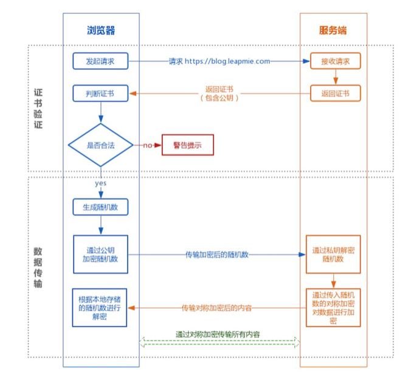
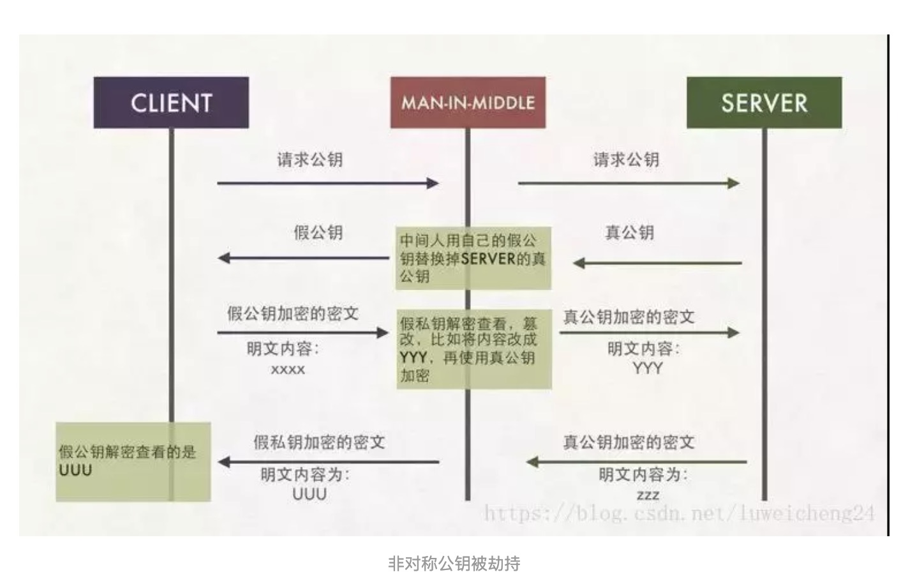
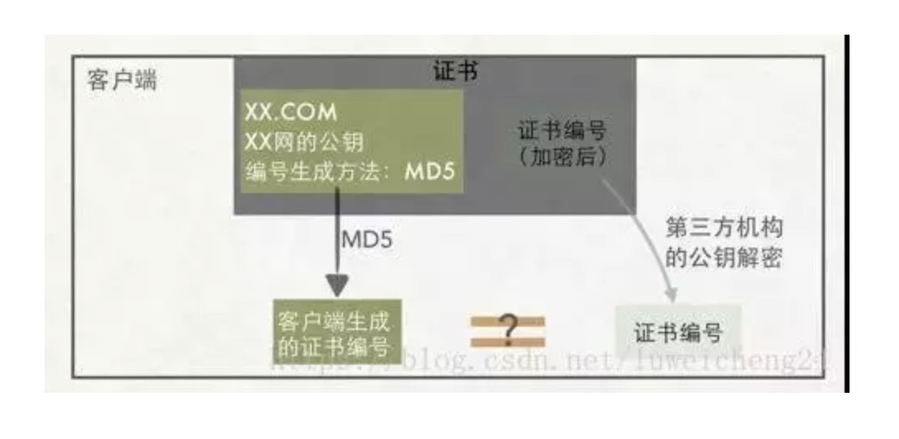
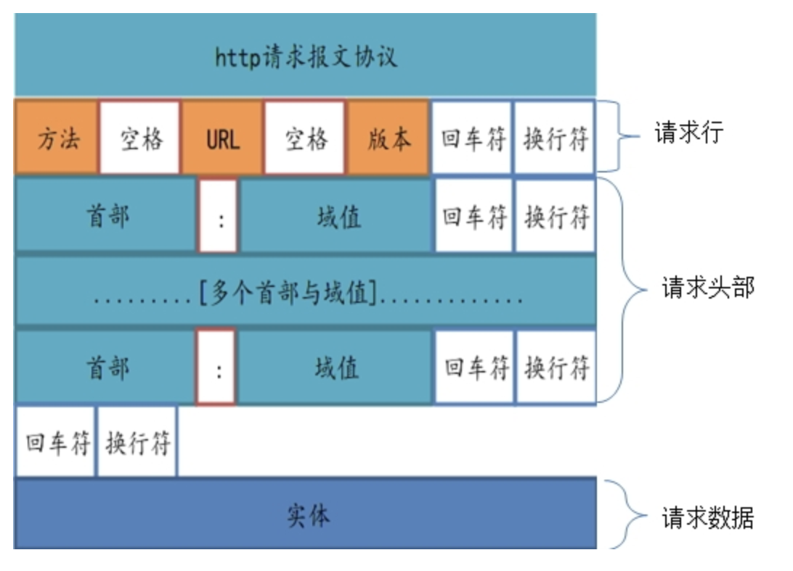
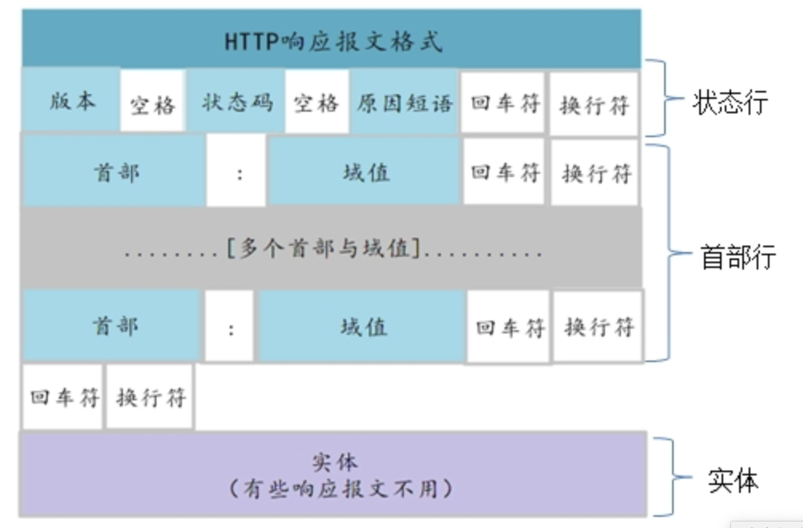

### HTTPS实现原理
HTTPS安全是因为会对传输的数据进行加密，而加密过程使用了非对称加密。
实际上，HTTPS在内容传输上使用的是对称加密，非对称加密只作用于证书验证阶段。  

#### 整体过程分为证书验证和数据传输  

##### 证书验证阶段
1.浏览器发起请求  
2.服务端返回https证书和公钥  
3.客户端验证证书是否合法，不合法则提示告警
##### 数据传输阶段
1.当证书验证合法后，本地生成随机数  
2.通过公钥加密随机数，将加密后的随机数和自己可实现的算法及必要信息传到服务端  
3.服务端通过私钥对数据进行解密  
4.服务端通过客户端传入的随机数构造对称加密算法，对返回结果内容进行加密传输

##### FAQ:  
HTTPS数据安全:对称加密传输,服务器与不同客户端使用不同的对称加密算法   
如何协商对称加密算法:通过随机数生成对称加密算法,每次交互的时候才会确定加密算法，
服务端和客户端每次交互都是新的加密算法，非对称加密算法进行协商的过程  
非对称加密公钥的传输:  
1.向我们服务器发送请求获取公钥  
2.向一个单独存放公钥的服务器发送获取公钥  

##### 非对称公钥传输被劫持过程:

##### 第三方机构解决公钥传输安全问题
公钥被调包的问题出现，是因为我们的客户端无法分辨返回公钥的人到底是中间人，还是真的服务器。
密码学中提的身份验证问题，不能直接将服务器的公钥传递给客户端，
而是通过CA，使用CA私钥对我们的信息进行加密后，再传给客户端。客户端再使用CA的公钥进行解密。
证书中包括公钥，颁发机构信息，公司信息，域名，有效期，指纹等，这个信息会被CA的私钥加密，
如果能解密，就说明这个公钥没有被中间人调包。因为如果中间人使用自己的私钥加密后的东西传给客户端，客户端是无法使用CA的公钥进行解密的。
数字签名即证书编号，解决CA颁发的不同证书被篡改问题。
现实中，浏览器和操作系统都会维护一个权威的CA列表，包括它们的公钥。  

### HTTP1/2/3

#### HTTP1.1
##### HTTP报文
请求报文和响应报文由多行数据结构构成的字符串文本，分为头部和主体两部分  
+ 请求行 method uri http版本
+ 状态码
+ 首部字段 包括请求和响应的条件、属性的首部
+ 其他

##### 状态码
+ 1xx 临时响应，代表请求被接受，仍需后续处理，响应报文中以空行结束
+ 2xx 成功处理请求 200 OK 201 Created
+ 3xx 希望请求方进一步操作，一般用于重定向 301 Moved 302 Found
+ 4xx 请求方出现错误 403 Forbidden 404 Not Found 405 Method Not Allowed
+ 5xx 服务端错误 500 Internal Sever Error 502 Bad Gateway 503 Service Unavailable

##### http1.1弊端
1. 队头阻塞，一条tcp连接同一时刻最多处理一条请求，当请求数超过tcp管道数时会发生阻塞等待  
2. 无状态特性，http头部会有很多过长的固定的字段，不同http请求中头部都带了大多数相同的信息，造成浪费  
3. 明文传输不安全  
4. 不支持服务器推送消息

##### http2特性
1. 二进制传输，http2将请求报文分隔成不同的更小帧，采用二进制编码，取代了报文结构  
2. header压缩，对报文头采用HPACK算法进行压缩，请求与服务端建立首部表字典，用索引号代表重复的字符串，避免了每次发送相同的数据
采用哈夫曼编码压缩整数及字符串  
3. 服务端推送，服务端可以将信息静态文件等预先推送给客户端，避免在请求的时候进行传输  
4. 二进制传输提高了安全性  
5. 多路复用，同域名下所有通信在单个链接上完成，单个连接可以承载双向数据流，数据流以分帧的形式发送，多个帧之间可以是乱序，
通过每帧的头部标识进行重组

##### http3特性
http2中解决了大多1中的问题，仍然存在其使用tcp协议本身的问题，即tcp+tls建立的时间问题  
在http2中，数据流的传输在一个tcp管道中，当发生了丢包时，会出现重传机制，影响其他请求的发送接收速率，某种程度上讲，http1.1中多条tcp连接
在发生丢包重传时只会影响到一条tcp连接，反而比http2表现的优秀  

http3中采用了QUIC协议(基于UDP)，实现了快速握手，保证了数据传输可靠，集成了多路复用，tls加密功能(具体实现google)

##### FAQ
http1.1中，单个tcp管道只能处理单个请求，即两个http请求的生命周期不能重叠  
一个支持持久连接的客户端可以在一个连接中发送多个请求（不需要等待任意请求的响应，收到请求的服务器必须按照请求收到的顺序发送响应  
http1.1中不能区分返回的内容对应的是那个请求发送的，只有通过顺序确定  
http2中采用二进制帧传输信息，每一个帧中都带有头部标识，可以乱序发送，会根据帧的头部标识进行重组

一个经典面试题目  
Q: 浏览器的地址栏里输入一个完整的URL，在按下回车直至页面加载完成，整个过程发生了什么  
A: (其中ip转mac由arp协议完成)
1. DNS解析(缓存->本地->dsn服务器)，查询到到域名对应的ip
2. 建立tcp连接
3. 发送http请求 
4. 处理响应并渲染至页面  
