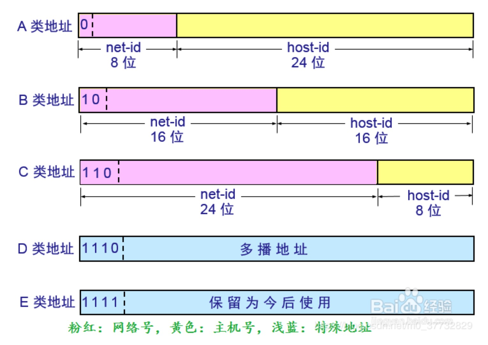

### ip地址
我们知道，MAC地址和网络无关，需要通过ip地址判断两台机器是否处于同一子网

IP地址分为IPv4和IPv6，IPv4由4个十进制数字表示的32位地址，例如C类地址192.168.1.0
IP协议将ip地址分为网络地址和主机地址(主机在局域网中的地址)

+ A类IP地址，第一段为网络地址，后三段为主机地址，A类网络有126个，网络地址的最高位必须是0，每个网络容纳主机1<<24，其中0代表任何地址，
127代表回环测试地址，实际地址范围为1-126，子网掩码为255.0.0.0
+ B类IP地址，前两段为网络地址，后两端为主机地址，网络地址的最高位必须是10，共有1<<14个网络，每个网络容纳主机1<<16，其中128.0.0.0和
191.255.0.0为保留ip，实际范围是128.1.0.0-191.254.0.0
+ C类IP地址，前三段为网络地址，最后一段为主机地址，网络地址的最高位必须是110，共有1<<21个网络，每个网络主机有254个，其中192.0.0.0和
223.255.255.0为保留ip，实际范围是192.0.1.0-223.255.254.0
+ D类IP地址，网络地址最高位必须是1110，是一个专门保留的地址，用于多点广播
+ E类IP地址，网络地址最高位必须是11110，保留

### 子网掩码
经常我们能看到C类型地址192.168.1.0，需要将这个网络划分为4个子网，子网之间不可相互通信，这四个子网的范围分别为  

192.168.1.0-192.168.1.63 (11111111-11111111-11111111-00*)  
192.168.1.64-192.168.1.127 (11111111-11111111-11111111-01*)  
192.168.1.128 -192.168.1.191 (11111111-11111111-11111111-10*)  
192.168.1.192-192.168.1.255 (11111111-11111111-11111111-11*)  

这时候，我们就可以通过子网掩码表示，会变成192.168.1.0/26，192.168.1.64/26，192.168.1.128/26，192.168.1.192/26  
/26是什么，它是255.255.255.192，它的二进制表示为11111111-11111111-11111111-11*，共有26个1，即用/26代替  

子网掩码为32位，/26的子网掩码中有32-26=6，即有1<<6个数的网址属于该子网  
将该子网分为8个网络，每个每个子网有32个地址，那么掩码就应该是32-5=27，第一个子网网段就应该是192.168.1.0/27，接下来类推