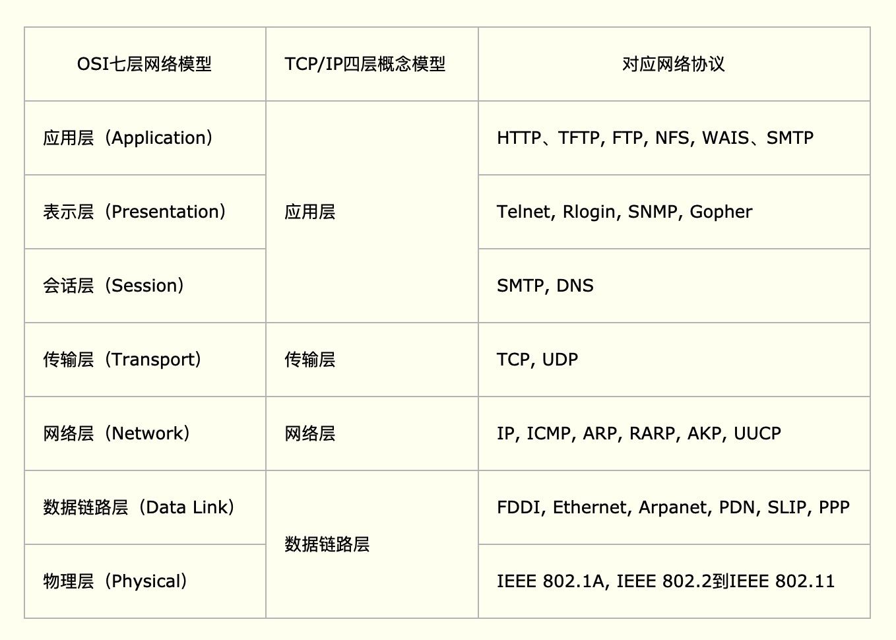
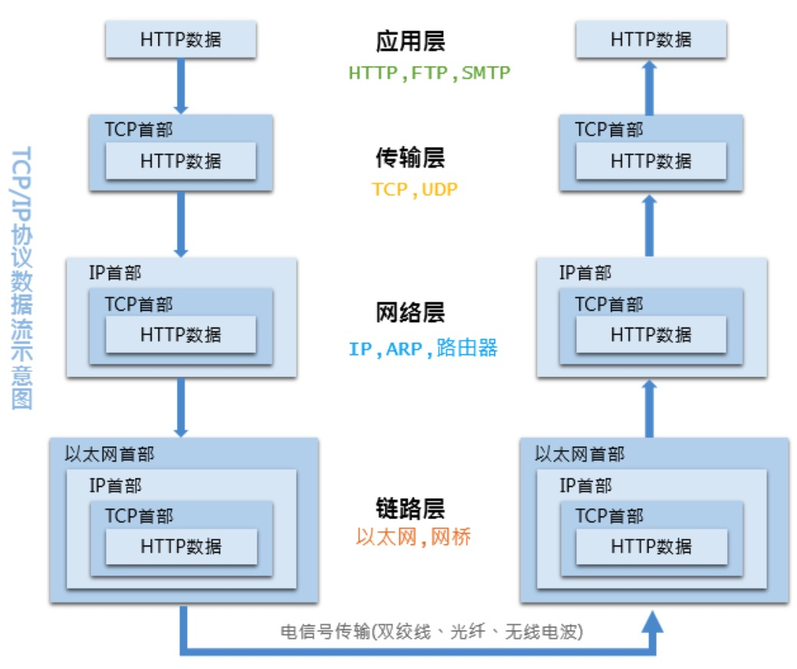

### OSI模型(分层网络协议)
|层次| 描述  | 注释 |
|:----|:----  |:----|
|应用层|是最靠近用户的OSI层，为用户的应用程序（例如电子邮件、文件传输和终端仿真）提供网络服务|HTTP FTP NFS等|
|表示层|可确保一个系统的应用层所发送的信息可以被另一个系统的应用层读取|TELNET等|
|会话层|通过传输层(端口号：传输端口接收端口)建立数据传输的通路|DNS SMTP等|
|传输层|定义了一些传输数据的协议和端口号|TCP UDP等|
|网络层|在位于不同地理位置的网络中的两个主机系统之间提供连接和路径选择|IP ARP等|
|数据链路层|定义了如何让格式化数据以帧为单位进行传输，以及如何让控制对物理介质的访问||
|物理层|模数转换 数模转换||

### TCP/IP分层模型
此模型中将物理层和网络链路层合并成链路层，会话层表示层应用层合并成应用层  

  

链路层：对0和1进行分组，定义数据帧，确认主机的物理地址，传输数据
网络层：定义IP地址，确认主机所在的网络位置，并通过IP进行MAC寻址，对外网数据包进行路由转发
传输层：定义端口，确认主机上应用程序的身份，并将数据包交给对应的应用程序
应用层：定义数据格式，并按照对应的格式解读数据

