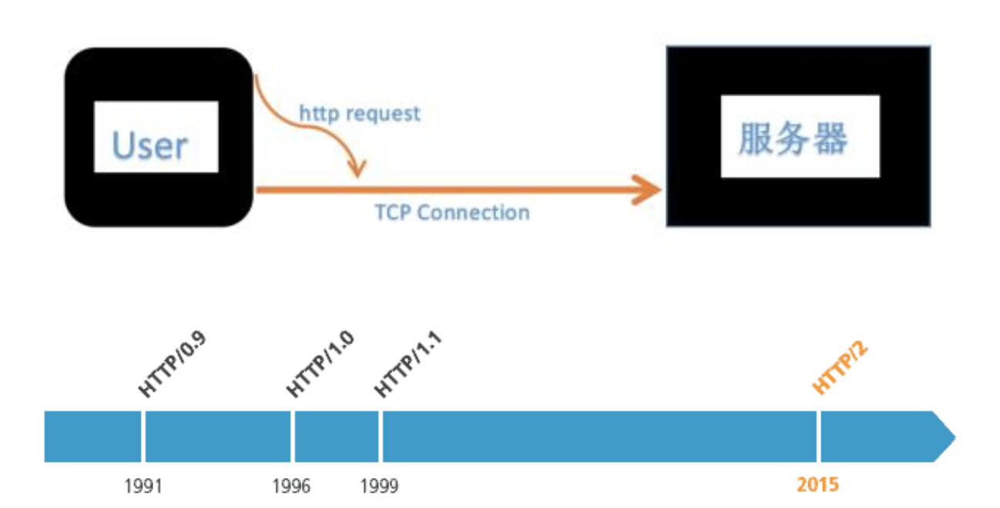
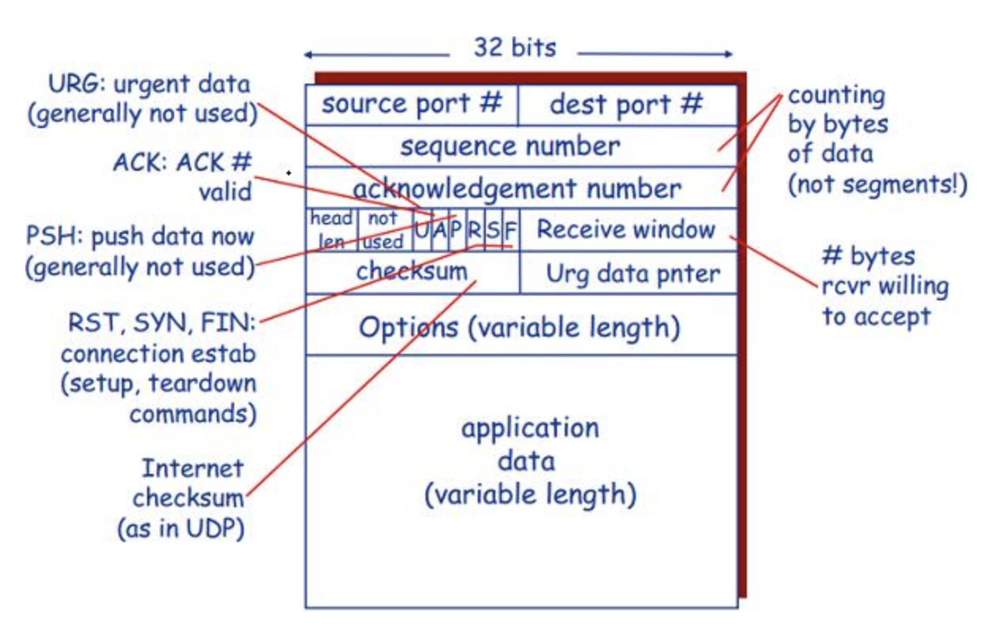
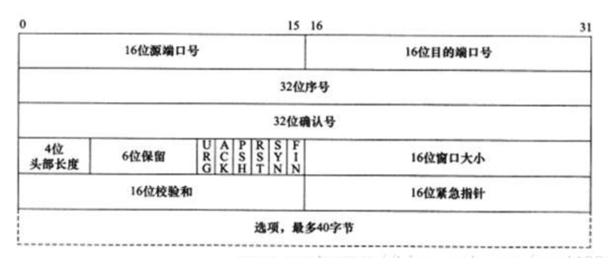
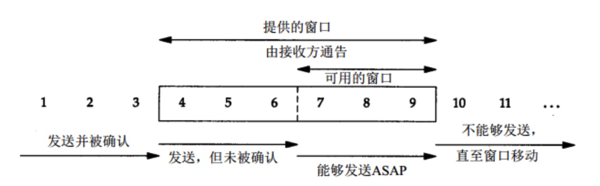
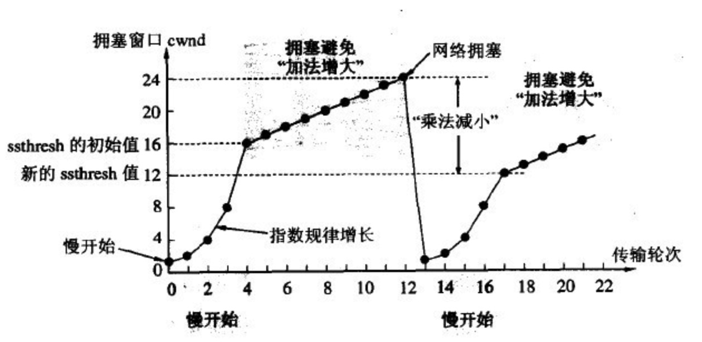
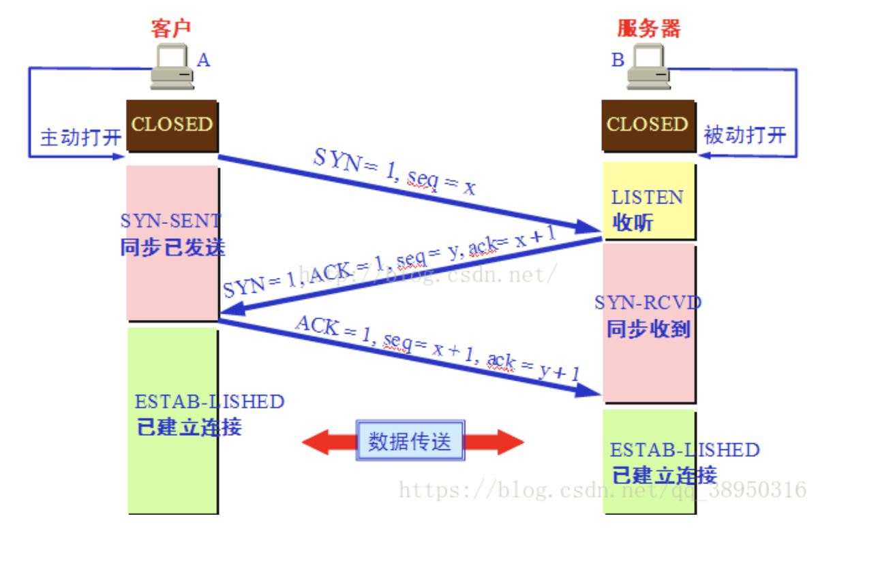
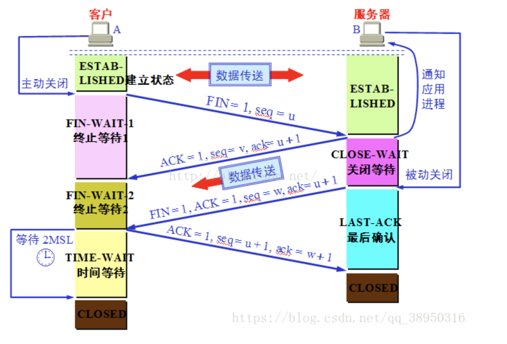

## tcp小解:
  

客户端与服务器之前建立连接前会创建一个TCP connection  
TCP相当于一条一直存在的通道，http请求在其上  
HTTP/1.0的TCP连接在创建http请求时同步创建的，在收到回复后TCP连接会断开
HTTP/1.1中TCP连接可以被申明一直存在，请求可以通过这条TCP连接一直发送，避免了网络资源的消耗(TCP连接建立需要三次握手)  
HTTP/1.2中http请求可以并发的发送

### TCP报文请求头 
  
  
+ 从上至下，从左至右依次为源端口，目标端口，序列号seq，确认号ack，头部长度，保留字段，标识位flags，滑动窗口(TCP可接收的窗口大小，滑动窗口协议),
校验和，紧急指针，可选数据数据  
+ 16位端口和目标标示该段报文来自哪里去往哪里  
+ 32位序列号seq标识一次TCP连接中某一次传输方向上字节流的每个字节的编号。假设A到B的方向上，该TCP报文中携带的数据为整个字节流中的100-200，
那么序列号seq为随机数+100，100即为偏移  
+ 确认号为对方的seq+1  
+ 头部长度为4位，代表十进制最大值为15，即TCP报文头部最大长度为15*4*8b，即60b，选项字段即最多为40b  
+ 保留字段目前未使用  
+ 标示位6位分别为URG(紧急指针是否有效),ACK(确认号是否有效，确认报文段),PSH(要求立即读取数据，清出空间),
+ RST(要求重新发起连接，复位报文段),SYN(要求建立连接，同步报文段),FIN(要求释放连接)  
+ 滑动窗口，告知对方己方tcp缓冲区大小  
+ 校验和为tcp报文段(包括头和数据)通过CRC算法得到的校验和  
+ 紧急指针是一个正的偏移量，它和序号字段的值相加表示最后一个紧急数据的下一字节的序号，因此这个字段是紧急指针相对当前序号的偏移量  

### 四种计时器
+ 重传计时器：在发送完数据之后，就会开始计时，如果在规定时间内没有收到发送报文的ACK就会重传该报文  
+ 坚持计时器：为了对付零窗口大小通知，TCP需要另一个计时器。假定接收TCP宣布了窗口大小为零。发送TCP就停止传送报文段，直到接收TCP发送确认
并宣布一个非零的窗口大小。但这个确认可能会丢失，在TCP中，对确认是不需要发送确认的。若确认丢失了，接收TCP并不知道，而是会认为它已经完成任务了，
并等待着发送TCP接着会发送更多的报文段。但发送TCP由于没有收到确认，就等待对方发送确认来通知窗口的大小。双方的TCP都在永远地等待着对方。
要打开这种死锁，TCP为每一个连接使用一个坚持计时器。当发送TCP收到一个窗口大小为零的确认时，就启动坚持计时器。当坚持计时器期限到时，
发送TCP就发送一个特殊的报文段，叫做探测报文段。这个报文段只有一个字节的数据。它有一个序号，但它的序号永远不需要确认，
甚至在计算对其他部分的数据的确认时该序号也被忽略。探测报文段提醒对端，确认已丢失，必须重传。
+ 保活计时器：用来防止在两个TCP之间的连接出现长时期的空闲
+ 时间等待计时器：即2*msl，时间等待计时器是在连接终止期间使用的

### TCP在IP层提供的不可靠服务基础上实现可靠数据传输服务
+ 流水线机制  
停止等待协议：是tcp保证传输可靠的重要途径，即指发送完一个分组就停止发送，等待对方确认之后，才能继续发送下一个分组
停止等待协议的优点是简单，缺点就是信道的利用率太低，一次只发送一个消息，信道大部分时间都是空闲的
+ 累积确认  
按序到达的最后一个分组进行确认，如果发送方发送了5个分组，接收端只收到了1 2 4 5 ，没有收到3，那么我的确认信息会是说明我期望下一个
收到的组是第三个，此时发送方会将3 4 5都重发一遍
+ TCP使用单一重传定时器
+ 触发重传的事件：超时和收到重复ACK

### 连续ARQ协议
解决停止等待协议导致的信道利用率过低问题  
发送方维护一个着一个窗口，窗口大小由接收方返回的win值决定，窗口中可以存在多个tcp分组，这样可以通过动态调整窗口大小达到充分利用信道的目的，
它采用累计确认的方式，对于按序达到的最后一个分组进行确认

### 拥塞控制(滑动窗口协议)

TCP利用一个滑动的窗口来告诉发送端对它所发送的数据能够提供多大的缓冲区，由16位定义，最大为65535个字节  
滑动窗口大小为0时启动坚持计时器  
拥塞窗口是发送方用的流量控制，而通告窗口则的接收方用的流量控制  
发送方取拥塞窗口与通告窗口中的最小值作为发送上限  

#### 超时重传
+ 分组丢失：发送方发出来了，接收方没有收到
+ 确认丢失：接收方收到了，也发送了确认分组，但是确认分组丢失了
+ 确认延时：确认分组没有丢失，由于传输太慢，发送方在规定时间内没有收到接收方发的确认分组

### 三次握手
1. A向B发功同步报文段SYN=1，序列号seq为x，并进入SYN_SENT状态  
2. B接收到SYN包，确认即ACK=1，ack=x+1，并发送SYN报文段SYN=1，seq=y，进入SYN_RCVD  
3. A接收到B的SYN+ACK包，确认SYN，发送ACK包，ack=y+1进入连接状态，B接收到A的ACK包后进入连接状态  

### 四次挥手
1. A向B发功FIN报文，seq=x，并进入FIN_WAIT_1状态  
2. B接收到FIN报文，发送ACK包，ack=x+1，并带上自身的seq=y，并进入CLOSE_WAIT状态  
3. A收到B的ACK包后进入FIN_WAIT_2状态  
4. B在CLOSE_WAIT状态中将未发送完的数据发送给A后发送FIN报文，FIN=1，ACK=1，ack=x+1，并带上自身的seq=z，并进入LAST_ACK状态  
5. A收到B的FIN报文，回复ACK报文，ACK=1，seq=x+1，ack=z+1，进入TIME_WAIT状态，经过2*msl(最大报文寿命时间)后进入CLOSE状态  
6. B收到A的FIN报文后，立即进入CLOSE状态  

### 拆包粘包
TCP作为面向连接的协议，发送的数据是无界的流，数据的合并拆分需要上层协议去自主实现(http的定长(content-length)和分块编码(chunked))
+ 使用带消息头的协议，消息头中储存开始标识和长度
+ 设置定长消息，每次读取一条定长字节作为一条消息
+ 设置消息边界标识，读取到消息标识时停止作为一条消息(数据中不能包含此边界标识)

### FAQ  
1. 三次握手而不是两次握手是因为防止已失效的连接又传到服务端导致发生错误，即确定是哪一次TCP连接  
客户端发出去的第一个连接请求由于某些原因在网络节点中滞留了导致延迟，直到连接释放的某个时间点才到达服务端，这是一个早已失效的报文，
但是此时服务端仍然认为这是客户端的建立连接请求第一次握手，于是服务端回应了客户端，第二次握手，如果只有两次握手，那么到这里，连接就建立了，
但是此时客户端并没有任何数据要发送，而服务端处于建立连接成功状态，造成资源浪费
2. 四次握手时B发送ACK包和FIN包不能同时发送，因为数据可能没有处理完  
3. 2*msl等待的意义在于，A必须知道B接收到了自己对B的FIN的ACK包，确认对方已经进入CLOSE状态，因为如果B如果没有接收到A的ACK包，会重传FIN包，
此时会重置2msl等待时间  
4. 当建立连接后A出现故障，在TCP连接中有一个保活计时器(2h)，收到A一次报文后B就会重置，经过该时效后B会发送探测报文，75s一个共10次，
A没有任何反应后B会关闭连接  

