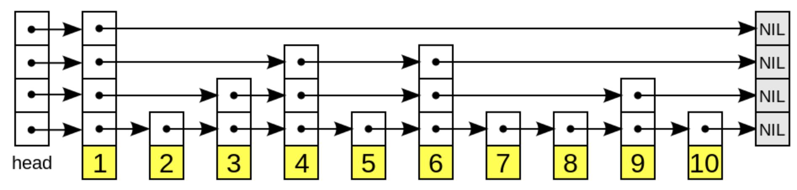
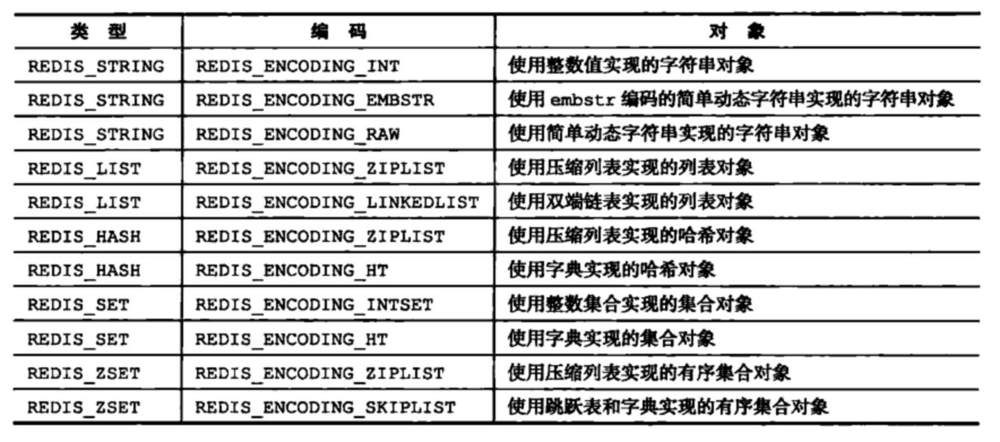

### redis底层数据结构
可以在redis客户端通过 object encoding key查看数据底层类型

#### SDS(simple dynamic string)简单动态字符串
```
struct sdshdr {
    int len     // 已使用长度
    int free    // 未使用长度
    char buf[]  // 字节数组
}
```
相对C语言的字符串结构多出了len和free的属性  
1.时间复杂度  
获取长度时直接通过len可以得到字符串长度，时间复杂度为1，而C时通过遍历得到，时间复杂度为N  
2.杜绝缓存区溢出  
通过len可以清楚的知道内存空间是否满足，不会出现缓冲区溢出，C语言通过contact进行字符串的拼接，没有分配足够的内存时会出现缓冲区溢出  
3.减少修改字符串造成的内存分配次数  
C语言由于不记录字符串的长度，所以如果要修改字符串，必须要重新分配内存（先释放再申请），
因为如果没有重新分配，字符串长度增大时会造成内存缓冲区溢出，字符串长度减小时会造成内存泄露
而对于SDS，由于len属性和free属性的存在，对于修改字符串SDS实现了空间预分配和惰性空间释放两种策略 
+ 空间预分配：对字符串进行空间扩展的时候，扩展的内存比实际需要的多，这样可以减少连续执行字符串增长操作所需的内存重分配次数
+ 惰性空间释放：对字符串进行缩短操作时，程序不立即使用内存重新分配来回收缩短后多余的字节，而是使用free属性将这些字节的数量记录下来，
等待后续使用，当然SDS也提供了相应的API，当我们有需要时，也可以手动释放这些未使用的空间  
4.二进制安全  
C语言中使用\0作为字符串的结束标示，而图片等可能包含了空字符串，C语言无法正确存取，而redis通过len去判断字符串是否结束

#### list(双向链表 无环)
```
type listnode struct { // 链表结点
    val *value      // 自定义结点值
    prev *listnode  // 前结点
    next *listnode  // 后结点
}
type list struct {  // 链表
    head *listnode  // 表头
    tail *listnode  // 表尾
    len int64       // 结点数量
    copy            // 复制函数
    free            // 释放函数
    match           // 对比函数
}
```

#### dictionary(map)
详见hash.md  
redis的字典采用的是链地址法(链表)解决hash冲突  
渐进式hash: redis的键值对存在很多时，实现扩容或收缩时不会一次性集中完成，这样会造成redis不可用。在渐进式rehash阶段，查找更新删除操作
会在两个hash表上进行，当第一个hash表未找到会去第二个，但是增加操作一定是在第二个hash表上操作

#### skiplist(跳表)
跳表是一种有序的数据结构，用在有序集合中，它在每个结点中维持多个指向其他结点的指针，具有以下性质:
+ 多层结构
+ 每一层都是一个有序的链表，排列顺序为由高层到底层，都至少包含两个链表节点，分别是前面的head节点和后面的nil节点
+ 最底层链表包含所有的元素
+ 下层元素包含上层所有元素
+ 链表的每个结点具有两个指针，一个指向同一层的下一个结点，另一个指向下一层的同一结点


搜索: 从最高层的链表搜索，找到当前结点比target大且下一个结点比当前结点小(或者到链表尾部)，往下层搜索，注意往下层搜索不是从头开始搜索，是
从上层搜索的区域中继续缩小范围搜索  
插入: 去定插入的层数，将元素插入该层及以下的所有层
删除: 在各层中找到指定的结点，逐一删除，若当前层只剩下头尾结点，删除该层

#### intset(整数集合)
用于保存整数值的集合抽象数据类型(int16 int32 int64)
```
type intset struct {
    encoding int32  // 编码类型
    length  int32   // 元素数量
    contents []int8  // 保存的元素数组
    // 整数集合的每个元素都是 contents 数组的一个数据项，它们按照从小到大的顺序排列，并且不包含任何重复项
    // 注意到contents申明成int8，但是数组并不保存int8类型的值，真正的编码类型由encoding决定
}
```
+ 升级: 当新增元素类型比原集合元素类型长度长时，进行升级  
1.根据新的元素类型，重新分配内存空间  
2.转换所有的底层元素到新的元素类型  
3.将新元素有序的添加到整数集合中
+ 降级: 不可降级

#### ziplist(压缩列表)
压缩列表不是对数据进行压缩，而是将数据按照一定的规则编码到一块连续的内存区域，达到节省内存的目的  
通常作为列表键和哈希键的底层实现之一

### redis五大数据类型对应数据结构
在redis客户端中使用type key可以显示对应的数据类型(string list hash set zset)
redis中对象由redisObject表示
```
type redisObject struct {
    类型
    编码
    指向底层数据结构的指针
    引用技术
    最后一次访问的时间
}
```

 
[redis数据结构类型和编码详解](https://www.cnblogs.com/ysocean/p/9102811.html)
