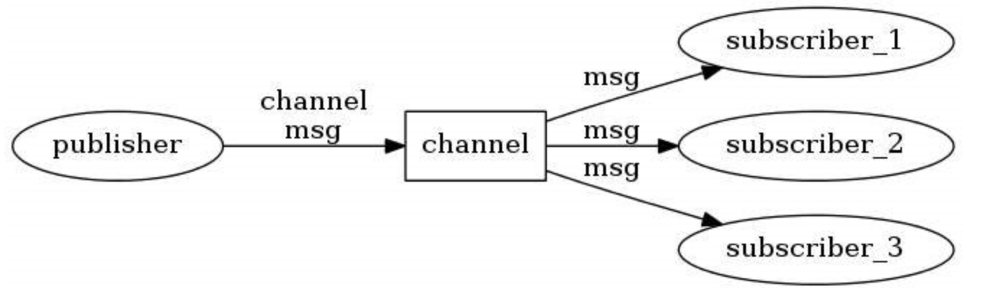
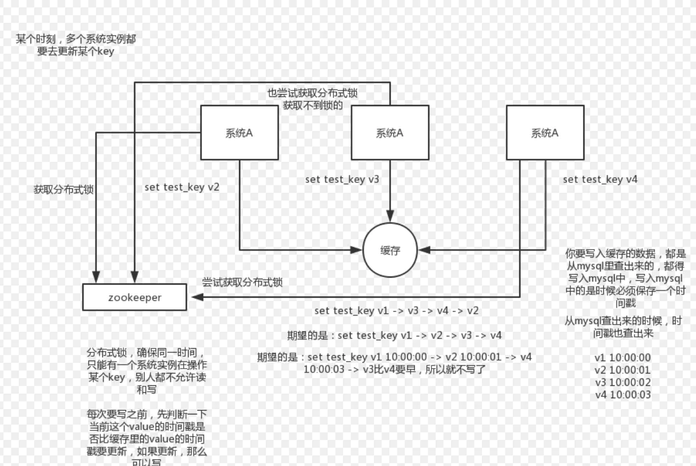
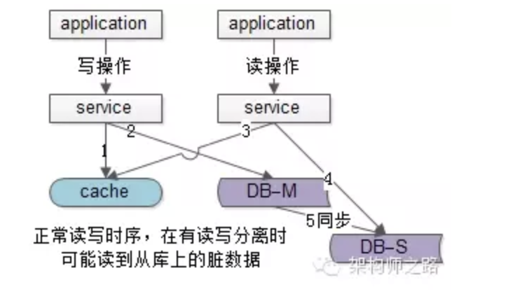

### 数据结构及底层实现
1. string基本数据结构  
2. list简单字符串列表，按照插入顺序排序，不去重，通常用于消息队列的服务已完成程序之间的交互  
3. hash存储的是field与value的映射表，通常用于存储结构化对象  
4. set为string类型的无序集合，通过哈希表实现，时间复杂度为1，通常用于查询交集并集差集操作  
5. zset为string类型的有序集合，每个元素会附带一个double类型的分数，键值不可重复，分数可相同，操作时会自动排序 

### 持久化
1. RDB(全量)，保存数据库状态，分为SAVE和BGSAVE，SAVE属于阻塞式，在进行持久化时redis将不处理任何请求，BGSAVE属于非阻塞式持久化，满足持久化条件后会创建
一个子进程进行持久化，主进程同时继续处理请求，相当于两个redis在运行  
2. AOF(增量)，保存对redis的写命令，分为三个操作步骤，命令追加，文件写入和文件同步。开启AOF后每一次的写操作都会将命令保存到AOF缓存中，然后将AOF缓存的数据写入到文件中，
在满足一定规则后会进行文件同步  
###### 文件同步规则(appendfsync)
1. always，没写入一条命令就会进行文件同步，保证了数据持久化的完整性和安全，但是效率是最慢的  
2. everysec，每秒进行一次文件同步，兼顾了效率和数据完整性，即使宕机也只会丢失前一秒的数据  
3. no，文件同步时机由系统决定，效率最高但是数据完整性没有保证  

### 模式
#### 主从模式
主从模式支持一主多从以及级联结结构，新加入的从节点需要从主节点SYNC全量数据  
步骤:
1. 从节点向主节点发送SYNC命令等待接收快照  
2. 主节点接收到SYNC命令后执行BGSAVE生成RDB文件并使用缓冲区记录之后所有的写操作
3. 主节点BGSAVE完成后将快照文件发送给从节点并将缓存区中的写命令发送到从节点
4. 从节点收到快照文件后丢弃自身文件并载入快照，完成载入后接收来自主节点的写命令(初始化完成)

+ 解决数据备份  
+ 负载均衡，读写分离 
+ 当实例发生故障，需要手动更改连接配置  
+ 当主节点故障，从节点无法SYNC到数据，其角色不会发生变化，需要人工转移故障  
+ 无法动态扩容

#### 哨兵模式
哨兵模式建立在主从模式上，由于主从模式不能改变自身模式，需要一个角色拥有选举的功能，redis-sentinel本身也是独立运行的进程
+ 监测所有redis节点的状态及其他哨兵的状态
+ 客户端连接哨兵的地址以获得服务
+ 当只有一个redis节点，哨兵模式没有意义
+ master节点挂掉后会进行领导者选举，然后从剩下所有的节点中选择出一个新的master节点进行故障转移，并修改其配置文件
+ 宕机的节点重新进入集群会作为slave节点并同步master的信息

###### 选举机制及故障转移
1. 主观下线，一个sentinel在经过sentinel down-after-milliseconds <masterName> <timeout> 的timeout都无法连通一个redis节点，那么就会
主观认为这个节点已下线(有可能网络原因等，所以需要客观下线)  
2. 当某个节点的被认为主观下线个人超过quorum(sentinel monitor <masterName> <ip> <port> <quorum>)(通常为半数+1)，就会客观下线并进行
选举和故障转移  
3. 选举机制
 - 每个做主观下线的sentinel通过命令要求将自己设置为领导者
 - 一个sentinel未投过票的会同意(其实就是最先到的有一票)
 - 当一个sentinel发现自己的票数超过quorum，那么会成为领导者并进行故障转移
4. 选择新的master节点，依据依次是：网络连接正常->5秒内回复过INFO命令->10*down-after-milliseconds内与主连接过的(网络好)->从服务器优先级(配置)
->复制偏移量大的(数据最完整)->id较小的(运行最早)

#### cluster模式
至少三主三从，集群本身带有哨兵的选举机制和故障转移功能  
当一个主节点和其从节点全部宕机，整个集群不可用

### 发布订阅(pub/sub)

发布者订阅者都是redis客户端，channel是服务端  
+ Redis没有提供对AMQP，MQTT，Stomp这些协议的支持
+ Redis无法对消息持久化存储，一旦消息被发送，如果没有订阅者接收，那么消息就会丢失 
+ Redis没有提供消息传输保障，不会因为客户端超时等原因重发消息 

### hash槽
redis cluster共有1<<14=16384个hash槽，由人工分配hash槽到集群节点，适用于节点的大小限制，很好的控制了数据的落点

### BloomFilter
通常用于检索一个元素是否在一个集合中  
go语言可以通过go get -u github.com/willf/bloom避免造轮子  
通过hash函数将元素映射到bit位，节省空间，查询效率高，但是不能删除，有一定误判  
bloomFilter对与一个元素如果在集合中不会误判，如果不在可能会出现误判(hash碰撞)  
比如A经过hash映射到1 3 5，B映射到2 7 10，都置为1，此时C是1 3 10，此时会误判C在其中
但是可以通过多个hash函数降低误判几率

###### 数据淘汰(LRU算法)
+ voltile-lru: 从已设置过期时间的数据集(server.db.expires)中挑选最近最少使用的数据淘汰
+ volatile-ttl: 从已设置过期时间的数据集中挑选将要过期的数据淘汰
+ volatile-random: 从已设置过期时间的数据集中任意选择数据淘汰
+ allkeys-lru: 从数据集中挑选最近最少使用的数据淘汰
+ allkeys-random: 从数据集中任意选择数据淘汰
+ no-enviction(驱逐): 禁止驱逐数据

###### 并发竞争key
1.分布式锁，得到锁的去执行  
2.消息队列(multi等)

###### 常见异常与解决办法
+ 缓存穿透: 查询缓存中没有，大量的并发请求都去到了持久层数据库  
1.增加校验，代码层增加校验，redis增加布隆过滤器(所有key值进行hash，只有存在的时候才去请求数据库)  
2.缓存空对象
+ 缓存击穿: 大量请求同一个key，在key值失效的瞬间大量请求会达到持久层数据库  
1.设置热点数据不过期  
2.每次访问该key进行expire
+ 缓存雪崩: 大量key值同时过期  
1.热点数据不过期  
2.随机分配过期时间  
3.分布式集群随机分配热点数据
+ 缓存预热: 在服务开启之前将热点数据预先加载到内存中
+ 缓存降级

###### 分布式锁与自增ID(INCR)

###### 阻塞、慢查询、大key

###### pipeline
允许客户端将请求依次发送到redis，中间不需要等待redis的返回，在最后一并取回返回的结果  
降低时延，提高吞吐量
pipeline将多个redis指令发出去，redis并不保证指令的执行是原子的  
multi相当于一个redis的transaction，保证了整个操作的原子性  
1.每发送一条指令，都需要单独发给服务器，服务器再单独返回“该条指令已加入队列”这个消息。这是比Pipeline慢的原因之一  
2.Multi执行的时候会先暂停其他命令的执行，类似于加了个锁，直到整个Multi结束完成再继续其他客户端的请求。
这是Multi能保证一致性的原因，也是比Pipeline慢的原因之二。

###### 缓存与数据库双写一致性
CAP三者最多满足两者，强实时一致性是通过提高延迟的方法来实现的(一致性 可用性 分区容错性)  
在分布式系统中，P是一定存在的，C和A的取舍视情况而定

使用缓存的场景: 读多写少
+ 淘汰缓存还是更新缓存
取决于操作复杂度，推荐淘汰缓存  

+ 先操作db还是先缓存
先操作db: 写db成功而淘汰缓存失败，会出现缓存db数据不一致  
先操作缓存: 淘汰缓存后更新数据库，无论成功与否只会造成一次hit miss  

+ 单db实例通过强行串行化可以实现db缓存强一致

+ 多db下
  

1.A发起写操作淘汰缓存，并写入db主库  
2.B发起读操作，miss读db从库  
3.写操作尚未完成或者主从同步未完成，B读取了脏数据并存入缓存  
4.写操作与主从同步完成  

+ 缓存双淘汰  
1.淘汰缓存  
2.更新db  
3.等待一定时间再淘汰缓存(消息队列，binlog)